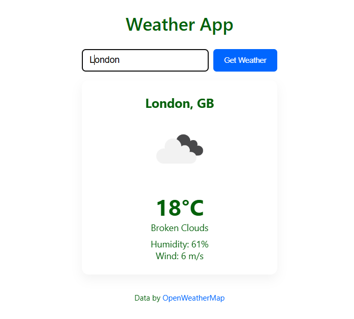

# 🌤️ React Weather App

 

A simple and responsive Weather App built with **React.js** and **CSS**, using the **OpenWeatherMap API**. Enter any city to get the current temperature, humidity, weather description, and wind speed.

---

## 🔧 Features

- Search for current weather by city name
- Displays:
  - Temperature (°C)
  - Weather icon and description
  - Humidity
  - Wind speed
- Fully responsive layout
- Styled with plain CSS
- Fetches live weather data using the OpenWeatherMap API

---

## 🚀 Demo


---

## 🛠️ Getting Started

### 1. Clone the repo

```bash
git clone https://github.com/your-username/react-weather-app.git
cd react-weather-app
